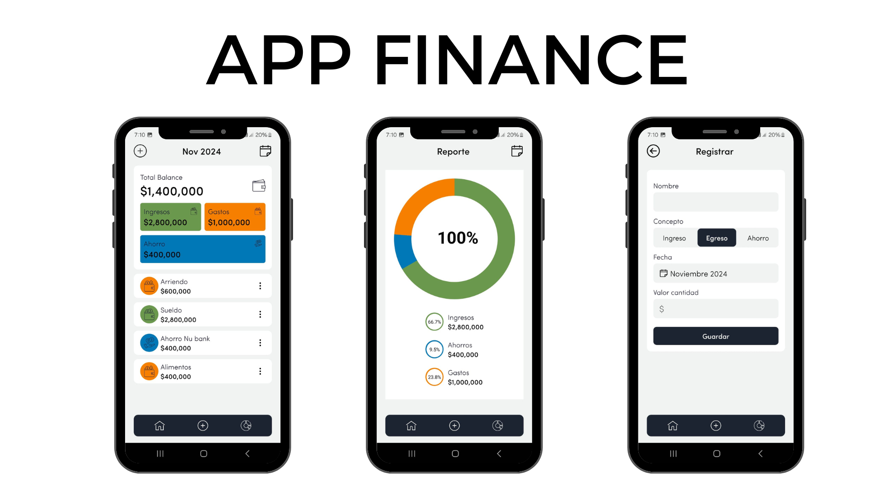

# :iphone:  App Finance



## 📖 Descripción

Aplicación sencilla enfocada en la gestión financiera personal. Permite organizar, registrar y generar informes sobre ahorros, gastos e ingresos, brindando una herramienta práctica para llevar un control eficiente de las finanzas.

## 🚀 Características

- ✨ Registros de Ingresos, Ahorros y Gastos
- 🔧 Informe grafica
- 🌟 Organizado de gastos y ahorros

## 🛠️ Tecnologías Utilizadas

- [React Native](https://reactnative.dev/)
- [Expo](https://expo.dev/)

## 📁 Estructura del Proyecto

```plaintext
/
├── src/
│   ├── ...
│   └── ...
├── assets/
│   └── imagen.png
├── README.md
└── ...
